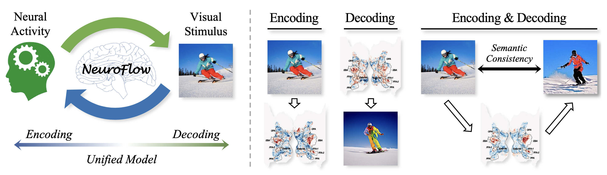

<!-- # CVPR 2026 | NeuroFlow 🧠✨🤖 -->
<!-- Official repository for the paper **SynBrain: Enhancing Visual-to-fMRI Synthesis via Probabilistic Representation Learning**.
[arXiv](https://arxiv.org/pdf/2508.10298) -->

<!-- ## NeuroFlow: Toward Unified Visual Encoding and Decoding from Neural Activity  -->

<h1 align="center">
  CVPR 2026 | NeuroFlow 🧠✨

<h1 align="center">
  <!-- NeuroFlow 🧠 <br> -->
  Toward Unified Visual Encoding and Decoding from Neural Activity <br>


<br><br>

### News
* Release [ArXiv paper](https://arxiv.org/abs/2604.09817).
* Release checkpoint and data.
* NeuroFlow has been accepted by CVPR 2026!!!
* **NeuroFlow** unifies visual encoding and decoding from neural activity with semantic consistency within a cross-modal flow model.

## Update NeuroFlow++
Add **Retrieval Submodule (8M)** and **Low-level Submodule(15M)** to improve Pixel-Level and Raw-Retrieval performance of NeuroFlow.

## Requirements
* Create conda environment using environment.yaml in the main directory by entering `conda env create -f requirements.yml` . It is an extensive environment and may include redundant libraries. You may also create environment by checking requirements yourself. 

## Data Acquisition and Processing

ps. You need to set your own path to run the code.

#### Option 1

1. Download NSD data from NSD AWS Server;
2. Download "COCO_73k_annots_curated.npy" file from [HuggingFace NSD](https://huggingface.co/datasets/pscotti/naturalscenesdataset/tree/main);
3. Prepare visual stimuli and fMRI data;
    ```
    python data/download_nsddata.py
    python data/prepare_nsddata_zscore.py -sub x
    ```
4. Extract CLIP image embedding by running `data/extract_features_sdxl_unclip.ipynb`

#### Option 2

Download preprocessed data from [HuggingFace NeuroFlow](https://huggingface.co/MichaelMaiii/NeuroFlow/tree/main)


## Model

Download model weight from [HuggingFace NeuroFlow](https://huggingface.co/MichaelMaiii/NeuroFlow/tree/main)

Download final results from [HuggingFace NeuroFlow](https://huggingface.co/MichaelMaiii/NeuroFlow/tree/main) for quick evaluation.

### Stage1 - BrainVAE Training: 
  ```
  bash script/vae/run_neurovae.sh
  ```

<!-- Run `srcipt/vae/train_neurovae.py` for BrainVAE training -->

<!-- ps. Change sys.path/save_path/data_path to run the code correctly. -->


### Stage2 - XFM Training:
  ```
  bash script/xfm/run_xfm.sh
  ```

<!-- Run `src/s2n/run_sit_os.sh` for subject-specific S2N mapper training.

Run `src/s2n/run_sit_os_ft.sh` for subject-adaptive S2N mapper training. -->

### Inference (Visual Encoding & Decoding):
  ```
  python script/generate_blurry.py
  python script/generate.py
  ```


### Evaluation:
  ```
  python script/eval.py
  ```


### Citation
<!-- ```
@article{mai2025synbrain,
  title={SynBrain: Enhancing Visual-to-fMRI Synthesis via Probabilistic Representation Learning},
  author={Mai, Weijian and Wu, Jiamin and Zhu, Yu and Yao, Zhouheng and Zhou, Dongzhan and Luo, Andrew F and Zheng, Qihao and Ouyang, Wanli and Song, Chunfeng},
  journal={arXiv preprint arXiv:2508.10298},
  year={2025}
}
``` -->
